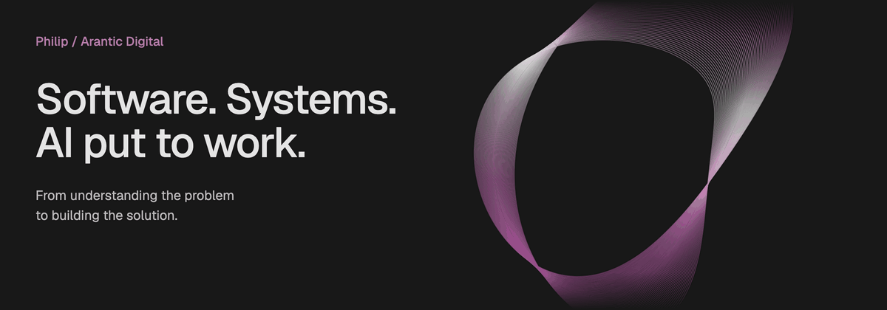

### Building the team. Shaping the solution. Staying technical.

I like understanding how things work, seeing where they fall short, and bringing the right people together to build something better. At **[Arantic Digital](https://arantic.com)**, that means creating software products and AI solutions, shaping the team, and staying involved in the architecture and code.

An IT and AI nerd at heart. I like understanding how things work, questioning how they’re done, and finding a better way with people who care about what they build.

**Business understanding. Engineering depth. Curiosity about what comes next.**

[Arantic Digital ↗](https://arantic.com) · [Our open source ↗](https://github.com/aranticlabs)
